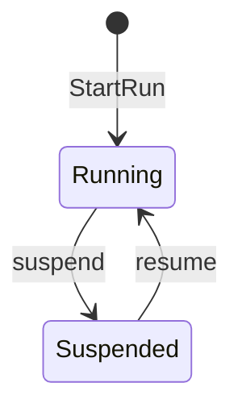

import validateSession from '@site/data/canon-validate.terminal.json';

Authors write plain Markdown. A table cell or inline code that is exactly `TRUE`, `FALSE` or
`UNKNOWN`, a status word such as `shipped`, or a protocol kind such as `claim`, becomes a chip with
its glyph. Nothing else changes.

## Three values

| Situation | Value |
| --- | --- |
| The check was never run | `UNKNOWN` |
| The check ran and failed | `FALSE` |
| The check ran and passed | `TRUE` |
| It passed for revision R1; the current revision is R2 | `UNKNOWN` |

| Capability | Status |
| --- | --- |
| Three-valued claim evaluation | shipped |
| Cases compose at run time | decided |
| Evidence freshness | planned |

A claim is `UNKNOWN` until applicable evidence decides it. Evidence kinds feed a `claim`; an
`action` may produce `evidence`; claims earn an `outcome`. In MDX the same chips are
<Truth value="true" />, <Truth value="unknown" /> and <Kind kind="obligation" />.

## Status admonitions

:::shipped[Claim evaluation]
`canon evaluate` gives every claim of a case one of the three values from its evidence records.
:::

:::note[Planned: evidence bound to revisions]
An admonition whose title starts with Shipped, Decided or Planned takes the status tone too.
:::

:::caution[Not a status]
Other admonitions keep their own tone.
:::

## A recorded session

The gutter shows each command's recorded exit; the recorder's `tones` colour the outcome words, and
JSON output takes the code colours.

<Terminal session={validateSession} />

## protocol/1 source

```yaml title="fixtures/investigation/protocol.yaml"
format: protocol/1

protocol:
  id: investigation
  revision: 1

evidence_kinds:
  supporting_observation:
    description: An observation consistent with the explanation.
  falsification_attempt:
    description: An attempt to refute the explanation; its result is survived or refuted.

claims:
  explanation.supported:
    description: The explanation is supported by observation and has survived falsification.
    true_when:
      all:
        - evidence:
            kind: supporting_observation
        - evidence:
            kind: falsification_attempt
            result: survived

actions:
  inspect:
    description: Look for observations bearing on the explanation.
    may_produce:
      - evidence: supporting_observation

outcomes:
  supported:
    description: The explanation is supported.
    requires:
      claim: explanation.supported
```

## A themed diagram



## Nothing yet

<EmptyState title="No protocol is published yet" action={{label: 'Read how protocols are written', href: '/docs/code'}}>
  The first protocol appears here once it is validated and merged. Until then, the examples above use
  the Canon fixture.
</EmptyState>
